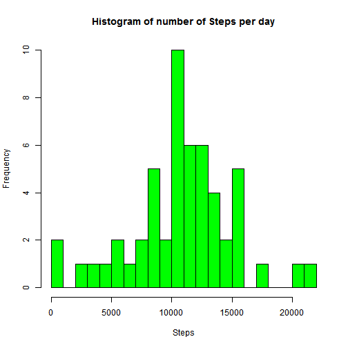
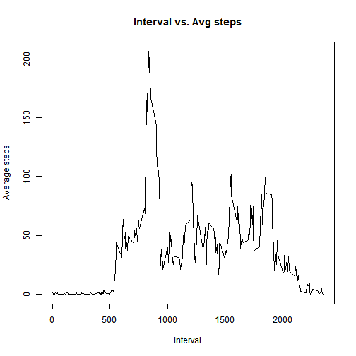
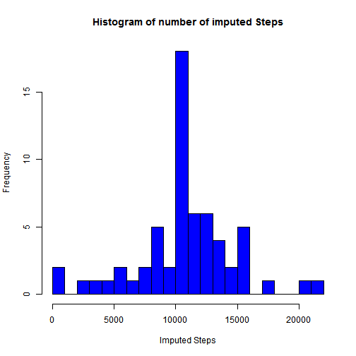
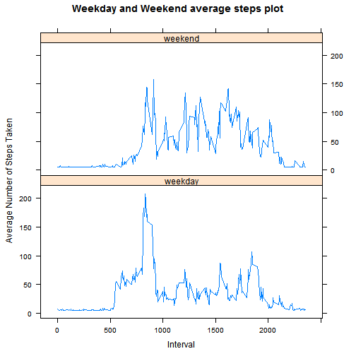

# Reproducible Research: Peer Assessment 1
 Author: Jayarama Ajakkala

 Date:  01/10/2016


```r
library(ggplot2)
library(plyr)
library(lattice)
```

## Loading and preprocessing the data

```r
hdata <-read.csv("activity/activity.csv")
dataClean <- hdata[!is.na(hdata$steps),]
```

## What is mean total number of steps taken per day?
 1. Make a histogram of the total number of steps taken each day

```r
 sumData <- aggregate(.~date, data=dataClean, FUN=sum)
  hist(sumData$steps, xlab="Steps", breaks=20, col="green", main="Histogram of number of Steps per day")
```


2.Calculate and report the mean and median total number of steps taken per day

```r
  mean(sumData$steps)
```

```
## [1] 10766.19
```

```r
  median(sumData$steps)
```

```
## [1] 10765
```

## What is the average daily activity pattern?
1. Make time time series plot of the 5 mins interval and average number of steps.

```r
  avgData <- aggregate(steps ~ interval, data=dataClean, FUN=mean)
  plot(avgData$interval, avgData$steps, type = "l", main="Interval vs. Avg steps", xlab = "Interval", ylab = "Average steps")
```



2.Which 5-minute interval, on average across all the days in the dataset, contains the maximum number of steps?


```r
  avgData[avgData$steps == max(avgData$steps),1]
```

```
## [1] 835
```

## Imputing missing values
1. Calculate and report the total number of missing values in the dataset

```r
  nrow(hdata[is.na(hdata$steps),])
```

```
## [1] 2304
```
2. Strategy to fill in the missing values

```r
  myavg <- mean(dataClean$steps)
```
3. New data set with missing data filled in 

```r
  tidyData <- transform(hdata, steps = ifelse(is.na(steps), myavg, steps))
```
4. Calculate mean, median with the new data set. Plot the histogram with new dataset

```r
  sumData2 <- aggregate(.~date,data=tidyData,FUN=sum)
  myavg <- mean(dataClean$steps)
  
  tidyData <- transform(hdata, steps = ifelse(is.na(steps), myavg, steps))
  sumData2 <- aggregate(.~date,data=tidyData,FUN=sum)

  mean(sumData2$steps)
```

```
## [1] 10766.19
```

```r
  median(sumData2$steps)
```

```
## [1] 10766.19
```

```r
   hist(sumData2$steps, xlab="Imputed Steps", col="blue", breaks=20, main="Histogram of number of imputed Steps")
```


## Are there differences in activity patterns between weekdays and weekends?

```r
  tidyData$days <- weekdays(as.Date(tidyData$date ))
  tidyData$dayof <- ifelse(tidyData$days == 'Sunday' | tidyData$days == 'Saturday', 'weekend', 'weekday')

  tidyMean <- aggregate(steps ~ interval + dayof, tidyData, mean)

  weekdays <- tidyData[tidyData$dayof=='weekday',]
  weekend <-  tidyData[tidyData$dayof=='weekend',]
  
  xyplot(
    steps ~ interval | dayof,
    tidyMean,
    type = "l",
    layout = c(1,2),
    main = "Weekday and Weekend average steps plot",
    xlab = "Interval",
    ylab = "Average Number of Steps Taken"
  )  
```


